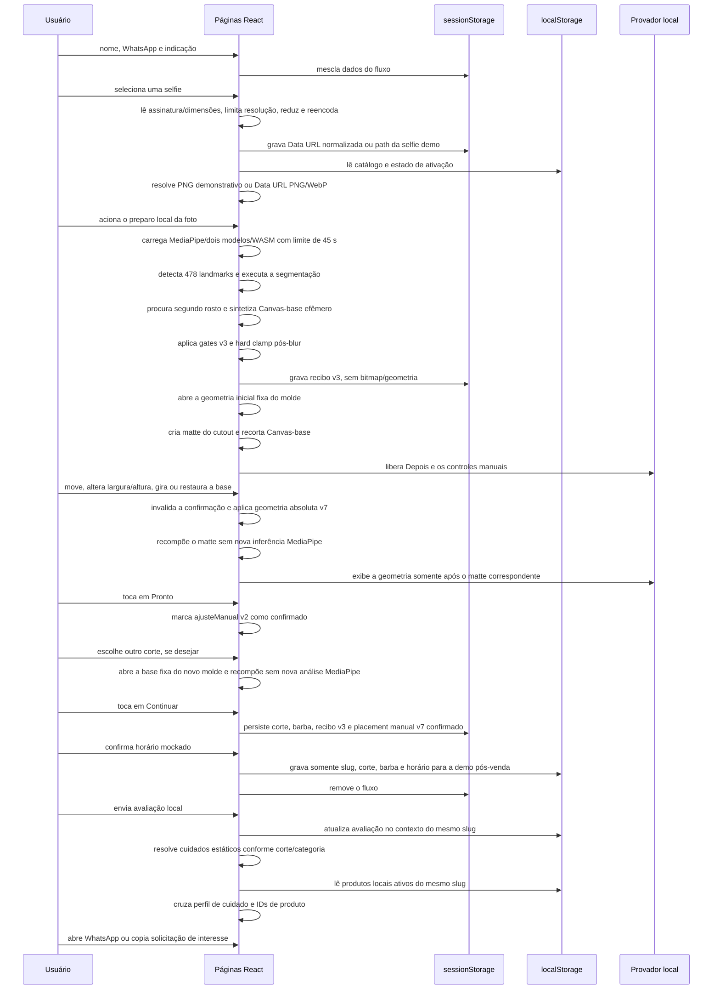

# Arquitetura

Última auditoria: **21/08/2026**.

## Resumo

O Barber Vision é uma aplicação Next.js 16 com App Router e duas partes em estágios diferentes. A jornada pública, o simulador e quase todo o domínio operacional ainda são locais: mocks, `sessionStorage`, `localStorage`, MediaPipe e Canvas no navegador. A simulação combina normalização da selfie, `FaceLandmarker` com 478 pontos, `ImageSegmenter` com SelfieMulticlass, síntese aproximada para ocultar o cabelo original, análise alpha, matte de oclusão e overlay 2D. Essas análises protegem o preparo, mas **não posicionam o novo corte**. O placement primário continua manual v7: base fixa do catálogo, ajuste separado de posição, largura, altura e rotação, seguido da confirmação em **Pronto**.

Autenticação possui uma integração Supabase SSR parcial. Quando as variáveis públicas existem, `proxy.js` renova cookies e valida claims com `getClaims()`, os layouts de servidor resolvem perfil, membership e barbearia e o navegador usa o cliente SSR para login, recuperação e MFA TOTP. O dono só deve alcançar dados de negócio em AAL2; em AAL1 existe um bootstrap mínimo para encaminhá-lo à matrícula/desafio de MFA sem consultar a barbearia protegida. Funcionários podem operar em AAL1. Esse caminho está versionado, mas não foi testado de ponta a ponta contra um Supabase real.

O restante do backend não está pronto. Existem cinco migrations — core, RLS, Storage, garantia de e-mail/AAL2 e onboarding/lifecycle/auditoria —, cinco rollbacks e 168 asserções pgTAP em duas suítes. Em 14/08, um `db:start` aplicou as cinco migrations e o seed durante um bootstrap transitório e chegou a **Starting containers**; em seguida o Storage respondeu HTTP 502, a pilha encerrou e as portas fecharam. Isso não substitui `db:reset`, lint, pgTAP, Data API/Storage com JWT, concorrência ou ensaio de rollback. A quinta migration define `convites_barbearia`, `eventos_auditoria` e nove RPCs consumidas pela UI de equipe, Server Actions, callbacks e script de provisionamento; sua reversão defensiva, o teste dedicado e o runner concorrente permanecem sem execução comprovada. O painel de negócio continua consumindo mocks/armazenamento local; os passos de privacidade e fluxo público persistido também não foram implementados.

Evidências temporais devem permanecer separadas do estado do código: o build foi aprovado novamente em **14/08/2026** no modo sem Supabase; o smoke HTTP permanece histórico de **13/08/2026**. O lint foi repetido em **21/08/2026** com exit `0`, zero erros e 18 warnings. Antes do bootstrap transitório de 14/08, `db:lint` e `db:test` chegaram à conexão local e terminaram em `ECONNREFUSED 127.0.0.1:54322`; isso não é lint nem teste SQL executado. Em **21/08/2026**, Docker Desktop/Supabase estão inativos, o serviço Docker está parado, não há listeners nas portas locais `54320–54324` e `supabase status` falha. A causa do HTTP 502 do Storage ainda é desconhecida e deve ser tratada como saúde/infraestrutura, não atribuída a RLS sem evidência.

Há dois modos explícitos de execução:

- sem variáveis Supabase: desenvolvimento oferece a demonstração local; em produção, `/admin` permanece sempre bloqueado e `/barbeiro/*` só é liberado pelo opt-in inseguro e server-only `BARBERVISION_ENABLE_UNSAFE_INTERNAL_DEMO=true`;
- com variáveis Supabase: o Auth SSR protege `/barbeiro/*`, a flag insegura não contorna a autenticação e `/admin` permanece bloqueado porque o Auth master ainda não existe.

```mermaid
flowchart LR
    C[Cliente no navegador] --> CP[Páginas /b/:barbearia]
    CP <--> CS[(sessionStorage<br/>barbervision:fluxo)]
    CP --> NC[Normalização da selfie]
    NC --> ML[MediaPipe + síntese Canvas local]
    ML --> MS[SelfieMulticlass TFLite<br/>segmentação same-origin]
    ML --> MF[FaceLandmarker task<br/>478 pontos same-origin]
    ML --> RB[Canvas-base + recibo v3<br/>sem placement automático]
    CP --> MP[Base fixa do catálogo<br/>placement manual v7]
    MP --> MR[Geometria absoluta<br/>X, Y, largura, altura e rotação]
    RB --> OC[Matte alpha + composição v3]
    MR --> OC
    OC --> VE[Provador fotográfico DOM/CSS local]
    CP --> DE[Assets estáticos de demonstração]
    CP <--> HC[(localStorage<br/>hair catalog v1)]
    CP <--> PV[(localStorage<br/>pós-venda v1 por slug)]
    CP <--> PC[(localStorage<br/>produtos v1 por slug)]

    E[Equipe no navegador] --> Q[proxy.js no Next 16]
    Q -->|sem env, desenvolvimento| DM[Sessão demo local]
    Q -->|com env| SA[Supabase Auth SSR<br/>cookies + getClaims]
    SA --> AC[Perfil + membership + tenant]
    AC -->|dono AAL1| MFA[MFA TOTP]
    AC -->|dono AAL2 ou funcionário AAL1| BP[Painel /barbeiro/*]
    DM --> BP
    Q -->|sempre bloqueado em produção/Auth real| A[/admin mock]
    BP <--> ES[(Contexto real ou<br/>sessionStorage somente demo)]
    BP <--> HC
    BP <--> PC
    BP <--> FF[(localStorage<br/>financeiro v1 por slug/mês)]
    BP <--> FP[(localStorage<br/>perfil financeiro v1 por slug)]
    BP --> M[lib/mockData.js]
    CP --> M
    A --> M

    PF[private-assets<br/>fontes recebidas] -. sem import ou consumidor .- CP

    SA --> S[Supabase configurado]
    SQL[supabase/migrations<br/>core + RLS + Storage + AAL2 + lifecycle] -. bootstrap transitório;<br/>validação pendente .-> S
    INV[UI/actions de convite] -. contratos versionados<br/>não testados .-> S
```

As setas tracejadas representam intenção, preparação ou ausência explícita de integração. O pipeline MediaPipe de preparo/remoção, o placement manual e a recomposição do matte usam setas contínuas porque estão ativos. `private-assets/` não participa do runtime: contém fontes manuais ignoradas pelo Git e fora do build.

## Camadas

| Camada | Local | Responsabilidade atual |
| --- | --- | --- |
| Entrada e rotas | `app/` | Páginas, layouts e navegação |
| Fronteira HTTP e sessão | `proxy.js`, `lib/supabase/proxy.js` | Seleciona demo sem env ou Auth SSR com env; renova cookies, valida claims, protege `/barbeiro/*` e mantém `/admin` bloqueado no modo real |
| Headers globais | `next.config.mjs` | Headers defensivos, COOP, remoção de `X-Powered-By` e configuração Turbopack |
| Jornada pública | `app/b/[barbearia]/` | Captação, selfie, atalho de demonstração, simulação, recomendação, escolha, avaliação e cuidados |
| Painel da equipe | `app/barbeiro/` | Telas de Auth e layout protegido já existem; dados operacionais continuam majoritariamente mockados/locais |
| Painel da plataforma | `app/admin/page.js` | Visão mockada de assinantes |
| Componentes | `components/` | Logo, botões, progresso, fidelidade, divisor e menu |
| Domínio temporário | `lib/mockData.js` | Barbearia, equipe, categorias, clientes, promoções e regras |
| Identidade e sessão | `lib/auth/`, `lib/supabase/`, `lib/barbeiroSession.js` | Contexto SSR real quando configurado e contexto/sessionStorage adulterável somente no modo demo |
| Simulação local ativa | `app/b/[barbearia]/simulacao/_cabelo/` | Segmentação/síntese local, análise de 478 landmarks, recibo v3, análise alpha, placement manual v7, matte de oclusão, camadas Antes/Depois e catálogo permitido |
| Modelos e runtime locais | `RemocaoCabeloAutomatica.jsx`, `remocaoCabeloAutomaticaLocal.js`, `public/modelos/`, `public/mediapipe/wasm/` | SelfieMulticlass para segmentação e FaceLandmarker para gates/geometria do preparo da cabeça, ambos carregados sob demanda da mesma origem; nenhum deles escolhe a posição do cutout |
| Catálogo local | `app/barbeiro/(painel)/catalogo/`, `lib/hairCatalog.js` | CRUD e recorte manual do dono em Canvas, contrato e persistência em `localStorage`; não é fallback do cliente |
| Pós-venda local | `lib/posVenda.js`, `lib/cuidadosCabelo.js`, `app/b/[barbearia]/avaliacao/` | Contexto mínimo por slug e plano cosmético determinístico derivado |
| Produtos locais | `app/barbeiro/(painel)/produtos/`, `lib/productCatalog.js` | Vitrine demonstrativa do dono, vínculos de cuidado, recomendação e solicitação por WhatsApp |
| Fechamento financeiro local | `app/barbeiro/(painel)/financeiro/`, `lib/fechamentoFinanceiro.js` | Lançamentos gerenciais por competência, separação serviço/produto, conciliação, fechamento/reabertura e CSV; não calcula nem transmite tributos |
| Vitrine pública | `components/VitrineProdutosCuidados.jsx` | Até três produtos locais relacionados ao perfil de cuidado; WhatsApp ou cópia |
| Fontes privadas manuais | `private-assets/cortes-recebidos-2026-07-21/` | Cópias fora de `public/`, Git, catálogo e build; usadas somente como referência ampla offline dos demos, sem recorte/publicação ou direitos confirmados |
| Fundação de dados | `lib/supabase/`, `supabase/` | Clientes browser/server/admin, cinco migrations, cinco rollbacks, seed, templates, dois pgTAPs e runner concorrente; bootstrap transitório observado, validação operacional pendente |
| Estilo | `app/globals.css`, `tailwind.config.js` | Tokens, fontes, animações e utilitários Tailwind |

## Renderização e fronteiras de execução

### Server Components

Além de páginas públicas e componentes visuais, o layout de `app/barbeiro/(painel)` é uma fronteira de servidor. No modo Supabase ele chama `exigirSessaoBarbearia()`, resolve a identidade por claims verificadas, lê perfil/memberships e injeta a sessão autorizada no contexto React. Layouts de módulos exclusivos do dono chamam `exigirDono()`. No modo demo esses mesmos layouts recebem o fallback local explicitamente marcado como demonstração.

`/admin` continua sendo uma página mock sem Auth master. O Proxy bloqueia essa rota em produção e sempre que o Supabase está configurado. Chunks e artefatos mock nunca devem conter dados reais, mesmo quando a navegação está bloqueada.

### Client Components

Todo o fluxo que usa formulário, câmera, timers, roteador, sessão ou filtros declara `"use client"`:

- cadastro, normalização da selfie, processamento, preparo/remoção local e posicionamento manual do corte, recomendação, escolha e avaliação;
- `RemocaoCabeloAutomatica.jsx` e seus utilitários são browser-only e fazem parte do grafo ativo de `CabeloSimuladorLocal.jsx`;
- inicializador client-side da rota de demonstração pronta;
- formulários de login, recuperação, redefinição, ativação e MFA;
- provedores e telas interativas do painel da barbearia;
- `Sidebar` e `useSessaoDono`.

No modo real, papel e tenant vêm do contexto de servidor e das policies; `sessionStorage` não é autoridade. No modo demo, a sessão continua adulterável e serve somente a dados fictícios. Várias páginas internas ainda executam filtros sobre mocks completos no cliente, portanto Auth parcial não torna o domínio operacional pronto para dados reais.

O inventário de 14/08/2026 possui **31 arquivos `page.js`** e **dois Route Handlers** (`/auth/callback` e `/auth/confirm`), além do Proxy. São 10 páginas públicas, 20 páginas em `/barbeiro` e a página `/admin`.

O inventário precisa ser regenerado sempre que arquivos de configuração/documentação forem adicionados; `proxy.js` e a configuração ESLint agora fazem parte da arquitetura. Perfis temporários em `tmp/`, dependências, artefatos de build e as cinco fontes privadas ignoradas continuam fora desse inventário.

Os números de **22,2 kB** próprios/**125 kB** de First Load JS pertencem a uma compilação histórica e não devem ser usados como baseline atual. Os dois modelos e o WASM permanecem fora do bundle e são carregados como arquivos estáticos same-origin. A cadeia instalada inclui Next `16.3.0`, `@supabase/ssr` `0.12.4`, `@supabase/supabase-js` `2.112.2`, MediaPipe `0.10.35`, Supabase CLI `2.112.0` e `pg` `8.23.0` para o runner concorrente. Build, lint, audit e testes são evidências temporais e precisam ser repetidos no release.

### Server-side, Auth e APIs

Existem dois Route Handlers de Auth:

- `/auth/callback`: troca o `code` PKCE por sessão e, se houver `convite`, tenta a RPC `aceitar_convite_barbearia`;
- `/auth/confirm`: verifica `token_hash` para confirmação, convite, recovery ou alteração de e-mail e também tenta aceitar convite quando aplicável.

Existem Server Actions na tela de equipe e um script de provisionamento de dono. Eles usam contexto de dono/AAL2 e cliente admin server-only. A quinta migration define as tabelas e RPCs que esses consumidores chamam, além de `suspender_funcionario`, `reativar_funcionario` e `revogar_funcionario`. Esses caminhos continuam **não operacionais e não comprovados**: o bootstrap transitório do schema não validou Auth, envio de e-mail, callbacks ou as operações pela aplicação. Também não existe API de domínio para clientes, agenda, simulações, avaliações, produtos ou financeiro.

Há três riscos P1 na orquestração atual. As compensações disparadas pelas actions de convite ignoram o resultado da RPC de revogação/marcação de falha e podem anunciar um estado que não foi confirmado. O provisionamento cria/convida a identidade Auth antes da RPC de banco e não possui transação distribuída, preflight, retomada ou reconciliação; uma falha pode deixar identidade órfã, e o banco pode materializar tenant/membership de dono ativo antes de a conta estar operacional. Por fim, `/auth/confirm` aceita a membership antes de a tela definir a senha; o portador do link já obtém sessão/membership ativa e pode alcançar o painel se nenhuma barreira adicional for criada. Esse comportamento precisa ser aceito explicitamente pelo produto ou corrigido antes do E2E.

Selfie, catálogo demonstrativo e placement continuam tratados no navegador. Não há persistência pública no Supabase.

### Proxy e headers

`proxy.js` usa o matcher `[/admin/:path*, /barbeiro/:path*, /auth/:path*]`.

- Sem configuração Supabase, o desenvolvimento libera a demo. Em produção, `/admin` sempre recebe `307` para `/?modo=seguro`; `/barbeiro/*` também recebe `307`, salvo o opt-in inseguro literal `true`.
- Com configuração Supabase, `/barbeiro/login`, `/barbeiro/esqueci-senha` e `/auth/*` são públicos; as demais rotas `/barbeiro/*` exigem claim autenticada. O Proxy renova cookies antes de prosseguir, envia anônimos ao login e usuários autenticados que abrem o login ao dashboard.
- Com Supabase configurado, `BARBERVISION_ENABLE_UNSAFE_INTERNAL_DEMO` não cria bypass. `/admin` permanece bloqueado porque a identidade da plataforma é um escopo separado.

Respostas do caminho Auth recebem `Cache-Control: private, no-store, max-age=0`. O bloqueio demo também envia `X-BarberVision-Safe-Mode: active`.

Essa bifurcação torna o bind do servidor uma fronteira operacional. `launcher.bat`, `npm run dev` e `npm run start` usam `127.0.0.1` explicitamente, e não existe script LAN. Isso contém a demonstração por padrão, mas o desenvolvimento sem Supabase ainda libera as rotas internas e nunca deve receber dados reais.

`next.config.mjs` define globalmente `X-Content-Type-Options: nosniff`, `X-Frame-Options: DENY`, `Referrer-Policy: strict-origin-when-cross-origin`, `Permissions-Policy: camera=(self), microphone=(), geolocation=()` e `Cross-Origin-Opener-Policy: same-origin`, além de `poweredByHeader: false`. CSP e HSTS ainda não foram implantados: CSP precisa ser compatível com Next/MediaPipe/WASM, e HSTS deve ser decidido no host HTTPS.

## Fluxo de dados público



Não há passagem pelo Supabase, agenda ou painel da equipe. O simulador não gera arquivo composto final: Canvas-base/composto, máscaras, matte, scores detalhados, os 478 landmarks, caixa facial, caixa do cabelo, cap elíptica, âncoras e residual geométrico ficam em memória; persistem apenas o recibo v3 e, ao tocar em **Continuar**, a geometria absoluta do placement manual v7 já confirmada em **Pronto**. Selfie, escolha, avaliação e catálogos demonstrativos permanecem no navegador. O contexto pós-venda não recebe selfie, recibo, placement, nome ou telefone. O plano de cuidados é derivado por `lib/cuidadosCabelo.js` e não é persistido como plano no `localStorage`. O WhatsApp, quando configurado, é apenas um link externo `wa.me`; copiar/abrir a mensagem não cria registro de reserva, pedido, pagamento ou estoque.

Na fronteira de entrada, a selfie tem `File.type`, assinatura e dimensões codificadas conferidos antes do decode. O cliente limita o original a 15 MB, 25 MP, 10.000 px por lado e mínimo de 320 px; tenta `createImageBitmap` redimensionado quando disponível, aplica fallback por Object URL e sempre produz JPEG 0,88 com maior lado de 1.600 px. A persistência continua síncrona em Data URL, mas falha de quota é mostrada e bloqueia a navegação.

## Fontes de estado

### `sessionStorage`

Existem duas chaves globais à origem:

| Chave | Conteúdo | Vida útil prática |
| --- | --- | --- |
| `barbervision:fluxo` | versão 2, slug, etapa, contato, selfie normalizada em Data URL ou path demo, corte, barba, recibo automático v3 e placement manual v7 confirmado | Até o fim da aba, nova jornada, limpeza final ou limpeza manual |
| `barbervision_sessao_barbeiro` | objeto mock `{ id, nome, papel }`, usado somente no modo demo sem Supabase | Até o fim da aba ou logout |

O fluxo público registra `barbeariaSlug` e a simulação rejeita estado de outro slug. Isso evita reaproveitar acidentalmente uma selfie antiga, mas não cria isolamento real de tenant: o catálogo continua global à origem, o slug não é validado no servidor e, no fallback demo, a sessão da equipe também é global. No modo Supabase a identidade fica em cookies SSR e não usa essa chave como autoridade. Sessões públicas anteriores à versão 2 são ignoradas, sem migração. Dentro do fluxo público v2, `neutralizacaoCabelo` é o nome histórico do recibo automático e precisa ter versão 3, algoritmo `hair-occlusion-canvas-v3` e conclusão. **Histórico:** placements v4, v5 e v6 — incluindo `ancoras-alpha-face-skin-v2`, `face-landmarks-alpha-v3`, `auto-fit-local` e sua variante refinada — são contratos legados e não liberam o avanço atual. A `revisaoEncaixe: 6` do catálogo é uma revisão dos assets/moldes e não deve ser confundida com a versão 6 rejeitada do placement.

O validador ativo `ajusteCabeloManualPrimarioValido` aceita somente o placement manual primário:

- `versao: 7`;
- `algoritmo: "manual-placement-v1"`;
- `origem: "manual-local"`;
- `automatico: false`;
- `ajusteManual: { versao: 2, aplicado: true, confirmado: true }`;
- `templateId`, corte, `moldeRevisao` e, para demos, asset compatíveis com o molde atual;
- geometria absoluta finita: `x` entre `0…100`, `y` entre `0…75`, `largura` entre `28…130`, `altura` entre `12…100` e `rotacao` entre `-45…45°`.

O fingerprint `moldeRevisao` usa asset + revisão nos demos e revisão/data/tamanho/hash curto da Data URL nos uploads. A base inicial depende somente de `transformacaoPadrao` do catálogo e dos defaults fixos `x: 50`, `y: 20`, `largura: 72`, `altura: 38` e `rotacao: 0`; ela não usa landmarks, caixa de cabelo ou medida da selfie. Movimento usa 1,5 ponto percentual, largura e altura usam passos independentes de 3 pontos percentuais e rotação usa 1°. `ajusteManual` v2 registra estado/confirmação, não deltas relativos: a geometria final está nos campos absolutos do placement.

Cada toque, mudança de corte ou evento relevante de `storage` invalida imediatamente a confirmação publicada; o CTA só volta depois do matte da geometria atual e de um novo toque em **Pronto**. Os ajustes e a troca de corte reutilizam Canvas-base/landmarks efêmeros, sem nova inferência. Se uma recomposição falhar, o último ajuste manual composto é restaurado; se a restauração falhar, o avanço permanece bloqueado. **Restaurar posição inicial** volta à base fixa do catálogo, nunca a um auto-fit. O placement v7 confirmado só é persistido no fluxo ao tocar em **Continuar**. Em reload, um v7 confirmado compatível é mantido como candidato durante o reprocessamento e só volta a ser publicado depois do matte. **Refazer preparo da foto** preserva a geometria em memória, limpa a confirmação persistida e exige novo **Pronto**.

### `localStorage`

- `barbervision:hair-catalog:v1` guarda o envelope do catálogo, inclusive ativação dos cinco demos, uploads em Data URL, `metadataRecorte`, o campo legado `encaixeAutomatico` e `revisaoEncaixe`. A revisão de molde atual é 6. A biblioteca inicial aponta para cinco PNGs sintéticos versionados em `public/demo-cortes` — Crop v3, Quiff v4 e os demais v2 nesta revisão; esses itens são fixos, ativos/autorizados/prontos, desativáveis e não editáveis/removíveis. O catálogo ainda preserva `nivelTemplo` e âncoras opcionais do molde por compatibilidade, mas o placement manual v7 não usa esses dados para posicionar o cutout. Um demo salvo com asset ou revisão antiga recebe novamente os defaults da revisão 6, enquanto uploads do dono são preservados. O simulador aceita somente a allowlist literal dos cinco paths ou uploads Data URL PNG/WebP válidos.
- `barbervision:pos-venda:v1:<slug>` guarda a demonstração pós-venda separada por slug. Da jornada, copia somente slug, corte, barba e horário; versão/timestamps e avaliação são metadados locais. Selfie, nome e telefone não entram nessa chave. `lib/cuidadosCabelo.js` usa o corte para gerar um plano estático após a avaliação.
- `barbervision:produtos:v1:<slug codificado>` guarda a vitrine demonstrativa, o número comercial configurado e imagens opcionais em Data URL. Cinco produtos fictícios são semeados; preço e quantidade são apenas valores locais de demonstração. `lib/productCatalog.js` relaciona IDs de cuidado a produtos ativos e monta o link/mensagem de interesse.
- `barbervision:financeiro:v1:<slug codificado>:<AAAA-MM>` guarda um fechamento gerencial por competência, com lançamentos em centavos, conciliação, eventos de fechamento/reabertura e fotografia do perfil declarada ao fechar. O mês atual começa com seis exemplos explicitamente fictícios; outras competências começam vazias.
- `barbervision:financeiro-perfil:v1:<slug codificado>` guarda separadamente nome empresarial, município/UF, porte, natureza jurídica, regime tributário declarado e contador. Esses campos contextualizam o CSV e não acionam fórmula tributária.

As cinco áreas continuam locais à origem, acessíveis a scripts do mesmo site e sem sincronização entre aparelhos. O slug na chave não cria isolamento seguro nem substitui banco, atendimento persistido, autorização/RLS, estoque, pedido, escrituração fiscal ou token único de avaliação. O fechamento é adulterável, não possui backup e não gera imposto, DAS, PGDAS-D, declaração, guia ou comprovante oficial.

### Estado React local

É descartado ao desmontar a página:

- Canvas-base/composto, máscaras, matte, scores detalhados, landmarks, caixa facial, caixa do cabelo, cap elíptica, amostras, âncoras alpha e residual;
- estado de carregamento/processamento/erro, análise do cutout, `composicaoPronta`, base manual fixa, candidato live, confirmação e mapa de geometrias por molde/revisão; somente recibo v3 e placement manual v7 confirmado entram no fluxo;
- polígono, máscara, feather e histórico curto do pincel durante uma sessão do editor de recorte **do dono**;
- nota/comentário antes do envio local e plano de cuidados derivado;
- horário final e confirmação antes da cópia mínima para o pós-venda;
- promoções criadas/editadas no painel;
- estado dos formulários do catálogo; a lista confirmada também é salva em `localStorage`.

`segmentadorPromise` e `analisadorCabecaPromise` ficam em escopo de módulo e podem reutilizar as instâncias carregadas em novas tentativas enquanto o módulo permanecer vivo. Falha de inicialização limpa o cache correspondente. Ainda faltam política explícita de descarte, medição de memória e testes de ciclo de vida em celulares.

### Módulo estático

`lib/mockData.js` é a fonte de verdade do protótipo. Imports recebem os mesmos valores iniciais, mas alterações feitas com `useState` não mutam o módulo nem chegam a outras rotas.

### Ambiente

- `NEXT_PUBLIC_SUPABASE_URL` e `NEXT_PUBLIC_SUPABASE_PUBLISHABLE_KEY` ativam juntas o modo Supabase. A chave publicável entra no bundle e depende de grants/RLS;
- `SUPABASE_SECRET_KEY` é server-only e hoje é usada apenas pelo caminho admin de convite; `service_role`/`sb_secret_*` nunca podem ser enviados ao navegador;
- `BARBERVISION_APP_URL` define a origem confiável usada nos redirects de e-mail fora do desenvolvimento;
- `BARBERVISION_ENABLE_UNSAFE_INTERNAL_DEMO` só afeta o modo **sem Supabase** e apenas quando o valor é exatamente `true`; não use `NEXT_PUBLIC_` nessa flag;
- ausência das duas variáveis públicas seleciona o fallback demo; configuração parcial gera erro deliberado em vez de misturar modos.

### Fontes privadas fora do runtime

Cinco arquivos recebidos em 21/07/2026 foram copiados, com hashes conferidos, para `private-assets/cortes-recebidos-2026-07-21/`. A pasta está no `.gitignore`, não é servida pelo Next.js e não possui import, manifesto ou referência em `hairCatalog.js`. As fotos foram usadas somente como referência ampla na autoria/revisão offline de novos cabelos sintéticos, sem cópia, recorte ou publicação dos originais. Consequentemente:

- o resultado visual usa cinco PNGs sintéticos versionados de `public/demo-cortes/`; a influência das fontes terminou na etapa offline de orientação de estilo;
- preservar os arquivos no workspace não cria backup no Git;
- nenhuma flag `direitosConfirmados` se aplica ao lote;
- origem, licença, autorização, classificação técnica, montagens, vistas em três quartos, texto, marca e o arquivo de Quiff acima de 1 MB continuam pendentes para qualquer uso direto/comercial;
- somente um cutout autorizado, revisado e versionado poderá atravessar essa fronteira e entrar no catálogo.

Inventário e triagem: [Fotos reais recebidas](FOTOS-REAIS-RECEBIDAS.md).

## Multi-tenancy atual

A arquitetura agora possui duas realidades distintas.

Na fundação SQL, `barbearias` é o tenant; `membros_barbearia` define papel/status por conta; clientes, atribuições, convites e eventos de auditoria exigem `barbearia_id`; FKs compostas impedem atribuição cruzada; grants/RLS negam outro tenant e anônimo. Os UUIDs históricos de procedência — `barbearias.criado_por`, `clientes.criado_por`, `membros_barbearia.convidado_por`, `atribuicoes_cliente.atribuido_por`, atores dos convites e ator/alvo da auditoria — não têm FK destrutiva para `auth.users`, para sobreviver à remoção da conta. A quarta migration exige e-mail confirmado/AAL2, e a quinta adiciona comandos estreitos de onboarding/lifecycle e auditoria append-only. Essa fundação foi aplicada somente no bootstrap transitório de 14/08 e ainda aguarda recriação e validação reproduzível num Supabase saudável.

Eventos de origem `usuario` exigem ator; eventos de origem `sistema` podem manter o ator nulo. Transições efetivas de lifecycle auditam, enquanto replay idempotente que já encontra o estado final é no-op e não duplica evento. O `CHECK` contra segredos óbvios olha apenas as chaves de primeiro nível de `metadados`, então payloads aninhados ainda precisam de sanitização. A troca direta de `atribuicoes_cliente.usuario_id` foi revogada para `authenticated`, e `service_role` perdeu `UPDATE` na tabela; falta uma RPC estreita e auditada para reatribuição.

No runtime existem dois níveis:

1. **Auth configurado:** o layout resolve `perfis`, memberships ativas e a barbearia no servidor; a sessão contém `barbeariaId`, papel e AAL. Até existir seletor, escolhe a membership ativa mais antiga. Isso autentica o contêiner, mas as telas de negócio ainda usam mocks e chaves locais;
2. **demo sem Auth:** a sessão local é adulterável e não possui isolamento confiável;
3. **jornada pública:** `/b/[barbearia]` ainda aceita qualquer slug e reutiliza `barbeariaExemplo`; não há resolução de tenant no banco;
4. catálogos e módulos locais têm graus diferentes de separação por slug, mas não oferecem isolamento server-side;
5. a tela de equipe consulta `convites_barbearia`, agora versionada, mas não deve ser considerada funcional antes de reset reproduzível, e-mail e E2E reais.

Portanto, a identidade SSR já carrega tenant por desenho, mas “multi-tenant seguro ponta a ponta” ainda não é propriedade comprovada. Isso exige aplicar/testar o SQL, concluir o ciclo de contas e substituir os mocks por consultas autorizadas sem contornar RLS.

## Autenticação e autorização atuais

### Modo Supabase configurado

1. o Proxy usa o cliente SSR e `getClaims()` para validar/renovar a sessão em cookies;
2. o layout chama `obterContextoAuth()` e consulta o próprio perfil e memberships ativas;
3. até existir seletor de unidade, a membership ativa mais antiga é escolhida;
4. o papel vem de `membros_barbearia`, nunca de metadata do JWT;
5. funcionário ativo pode operar em AAL1; dono em AAL1 recebe apenas a sessão mínima necessária para ser redirecionado a `/barbeiro/mfa`;
6. dono em AAL2 pode alcançar layouts exclusivos, e a migration `auth_assurance` reforça o mesmo step-up em RLS/Storage;
7. login com senha, recuperação, redefinição, ativação, TOTP, logout local/global e templates locais existem no código.

Esse caminho é **parcial e não validado de ponta a ponta**. Não há `.env.local`, projeto remoto vinculado ou SMTP hospedado configurado. O bootstrap transitório de 14/08 aplicou o schema e o seed, mas terminou após o HTTP 502 do Storage; em 21/08, Docker/Supabase e suas portas locais estão inativos. Convites, provisionamento, lifecycle e auditoria não foram exercitados pela aplicação; rollback e pgTAP estão versionados, porém sem execução comprovada. Ainda faltam outbox/retry, caminho comprovado para usuário Auth existente, transferência de dono, recuperação quando o TOTP é perdido, seletor de tenant e testes de browser/API/JWT.

### Modo demonstração sem Supabase

O usuário escolhe um personagem fictício, e o objeto é salvo sem assinatura no `sessionStorage`. O contexto React separa esse fallback da sessão real, mas ele continua adulterável, entrega mocks no bundle e serve somente para apresentações locais. Em produção fica bloqueado por padrão; o opt-in inseguro não autoriza dados reais.

## Estrutura de diretórios

```text
barbervision/
├── app/
│   ├── b/[barbearia]/
│   │   ├── page.js, demo/, cadastro/, selfie/, processando/
│   │   ├── simulacao/page.js
│   │   ├── simulacao/_cabelo/                        # MediaPipe, Canvas, matte e placement manual v7
│   │   └── recomendacao/, escolha/, avaliacao/
│   ├── barbeiro/
│   │   ├── login/, esqueci-senha/, redefinir-senha/
│   │   ├── ativar-conta/, mfa/, sem-acesso/
│   │   └── (painel)/
│   │       ├── layout.js                             # fronteira Auth SSR/contexto da sessão
│   │       ├── dashboard/, clientes/, simulacoes/, historico/, avaliacoes/
│   │       ├── funil/, promocoes/, comissoes/, fidelidade/
│   │       ├── financeiro/, produtos/, catalogo/, seguranca/
│   │       └── equipe/                               # UI/actions; SQL versionado, não testado
│   ├── auth/
│   │   ├── callback/route.js                         # troca PKCE por sessão
│   │   └── confirm/route.js                          # confirma token_hash/OTP
│   ├── admin/page.js
│   ├── page.js
│   ├── layout.js
│   └── globals.css
├── components/
├── lib/
│   ├── auth/                                         # contexto e URL confiável de callback
│   ├── supabase/                                     # clientes browser, server, proxy e admin
│   ├── barbeiroSession.js                            # provider real + fallback demo isolado
│   ├── clienteFlow.js, mockData.js, hairCatalog.js
│   ├── posVenda.js, cuidadosCabelo.js, productCatalog.js
│   └── fechamentoFinanceiro.js, dataUtils.js, useSessaoDono.js
├── scripts/provision-owner.mjs                       # RPC versionada, fluxo não testado
├── private-assets/                 # ignorado pelo Git; nunca servido pelo app
│   └── cortes-recebidos-2026-07-21/
├── public/
│   ├── demo-cliente.png
│   ├── demo-cortes/*.png
│   ├── modelos/selfie_multiclass_256x256.tflite
│   ├── modelos/face_landmarker.task
│   └── mediapipe/wasm/*
├── supabase/
│   ├── migrations/                  # core, RLS, Storage, assurance e onboarding/lifecycle
│   ├── rollback/                    # cinco reversões manuais e defensivas
│   ├── tests/database/              # 59 + 109 asserções pgTAP
│   ├── templates/                   # convite e recuperação locais
│   ├── config.toml
│   ├── seed.sql
│   ├── README.md
│   └── schema.sql                   # aviso; não é schema executável
├── proxy.js                         # convenção Next 16; demo segura ou Auth SSR
├── next.config.mjs                 # headers e remoção de X-Powered-By
├── eslint.config.mjs
├── docs/
└── AI context.md
```

Grupos de rota entre parênteses, como `(painel)`, organizam arquivos e não aparecem na URL.

## Identidade visual

Os tokens ficam em `tailwind.config.js`:

| Token | Cor | Uso predominante |
| --- | --- | --- |
| `ink` | `#000000` | Fundo |
| `parchment` | `#EDE3D0` | Texto principal |
| `brass` | `#C6963B` | Ação/destaque |
| `brass-dim` | `#8F6C28` | Hover |
| `barber` | `#8C2F39` | Acento secundário/alerta |
| `steel` | `#6B6459` | Texto secundário/bordas |

`Anton` é usada em títulos e `Manrope` no corpo via `next/font/google`. A faixa diagonal de `PoleDivider` é a assinatura visual. O CSS também fornece foco visível e reduz animações quando o sistema solicita `prefers-reduced-motion`.

## Recursos estáticos

`public/` contém `logo-barbervision.png`, o retrato fictício `demo-cliente.png`, cinco recortes sintéticos ativos, sete versões de rollback em `demo-cortes/`, os modelos SelfieMulticlass e FaceLandmarker e as variantes WASM/JS do MediaPipe. Os dois modelos e os binários/runtime somam **53.885.062 bytes**, aproximadamente **51,4 MiB**, no conjunto estático; o README dos modelos não entra nessa soma e isso não significa que o navegador baixe todas as variantes a cada uso. O catálogo inicial referencia somente a revisão ativa de cada corte; os rollbacks são publicamente endereçáveis pelo path, mas a allowlist do provador impede carregá-los. Recortes criados pelo dono continuam como Data URL no `localStorage`.

Os cinco arquivos de `private-assets/` não são recursos estáticos e não devem ser movidos para `public/` como fotos brutas. O antigo export `bibliotecaCortes` foi removido de `mockData.js`. Origem e política de substituição estão em [Assets de demonstração](ASSETS-DEMONSTRACAO.md); o lote privado está em [Fotos reais recebidas](FOTOS-REAIS-RECEBIDAS.md); a fronteira do pipeline automático está em [Remoção automática local](REMOCAO-AUTOMATICA-LOCAL.md).

`next.config.mjs` não mantém allowlist remota de imagens no estado atual. Ele desativa `X-Powered-By`, configura a raiz do Turbopack e aplica headers defensivos a todas as rotas e assets. Modelos `.task`/`.tflite` e arquivos WASM foram verificados com resposta `200` e esses headers.

## Restrições arquiteturais confirmadas

- Existe Auth SSR parcial, mas não há backend de domínio, serviços ou repositórios persistentes para o fluxo público e o painel;
- há Server Actions de convite e dois Route Handlers de Auth; o SQL de convites/provisionamento/lifecycle/auditoria passou apenas pelo bootstrap transitório, sem teste funcional;
- os UUIDs de procedência são históricos, sem FK destrutiva para Auth; o `UPDATE` direto da atribuição foi revogado, mas ainda não existe RPC estreita de reatribuição;
- auditoria exige ator em eventos de usuário e não duplica evento em replay no-op, porém a verificação de nomes de segredo em `metadados` cobre somente o nível superior;
- cinco migrations e o seed chegaram a ser aplicados no bootstrap transitório de 14/08; os cinco rollbacks e os dois testes de banco continuam sem execução, e não há `db:reset` validado;
- as migrations 4–5 têm rollbacks/teste dedicado, ainda sem ensaio, lint PostgreSQL comprovado ou evidência concorrente;
- três buckets privados estão definidos nas migrations; no runtime do aplicativo, porém, não há upload/leitura de Storage e as imagens continuam somente na persistência demonstrativa do navegador;
- no fluxo ativo existem segmentação, FaceLandmarker com 478 pontos, síntese automática aproximada para a remoção e matte alpha do cutout, mas não há reconstrução anatômica 3D, deformação de malha, oclusão semântica avançada ou adaptação automática de luz/perspectiva;
- o placement do cliente é uma transformação 2D manual com posição, largura, altura e rotação absolutas; ele não usa a geometria facial para posicionar o cutout, não corrige perspectiva e não substitui os gates automáticos do preparo;
- cabelo original fora da cap não é apagado; o matte apenas limita a pele sintética à silhueta do cutout, portanto mover, reduzir ou girar um asset pode expor laterais. A validação numérica de cobertura depois do ajuste manual continua pendente;
- a validação de múltiplos rostos combina FaceLandmarker para até duas faces e uma heurística de segundo componente `face-skin`; ainda não garante reconhecer toda montagem nem validar pose/oclusões;
- o pipeline local de cabelo e pele/cabeça faz parte do grafo ativo e possui limite de 45 segundos para carregar selfie/runtime/dois modelos; qualidade e desempenho ainda não foram validados em aparelhos-alvo;
- sem fila, webhook, cron ou processamento assíncrono;
- sem analytics, logs estruturados, tracing ou monitoramento;
- sem suíte automatizada de aplicação, TypeScript ou schema validation; existem dois pgTAPs, um para a baseline do passo 2 e outro para assurance/onboarding/lifecycle/auditoria do passo 3, ambos ainda não executados. No segundo, provisionamento do dono e marcação de falha têm somente asserções estruturais/ACL, não cenários funcionais;
- sem CI/CD, container ou configuração específica de provedor de deploy;
- sem internacionalização; textos são pt-BR embutidos nos componentes.

## Dependências entre módulos

- `mockData.js` é altamente central e alimenta home, fluxo público, painel e admin;
- `clienteFlow.js` só deve ser importado por Client Components;
- `barbeiroSession.js` fornece o contexto recebido do layout no modo Supabase e mantém helpers de `sessionStorage` somente para a demo; consumidores devem usar `useSessaoBarbeiro()`;
- `lib/auth/context.js` valida claims, perfil e memberships no servidor. Dono AAL1 recebe somente bootstrap de MFA; layouts exclusivos usam `exigirDono()`;
- `useSessaoDono.js` ajuda a experiência no cliente, mas a barreira real dos módulos exclusivos é o layout de servidor mais RLS;
- `hairCatalog.js` usa uma chave global à origem, sem slug/tenant; os cinco demos ativos têm calibração inicial individual, mas ela foi aferida apenas na selfie fictícia, e uploads afetam qualquer slug no mesmo navegador;
- `neutralizacaoCabeloLocal.js` e `CoberturaCabeloOriginal.jsx` preservam o contrato/Canvas manual antigo, mas não possuem import no fluxo principal; não confundir esse legado com o editor manual do dono no catálogo nem com o placement manual geométrico do cliente;
- `CabeloSimuladorLocal.jsx` renderiza `RemocaoCabeloAutomatica.jsx`, que inicializa `ImageSegmenter` e `FaceLandmarker`, lê os dois modelos, desenha o Canvas-base e o recorta pelo matte do corte. `remocaoCabeloAutomaticaLocal.js` concentra contratos, landmarks normalizados, máscara, componentes conexos, dilatação, feather, síntese e recibo v3;
- `cabeloCatalogoLocal.js` gera a base fixa do catálogo e o placement v7 `manual-placement-v1`. O contrato usa `manual-local`, `automatico: false`, `ajusteManual` v2 e geometria absoluta; largura e altura são independentes. O módulo também gera `moldeRevisao`, valida identidade/limites e confirma o candidato. Funções v6 de auto-fit ainda existem no arquivo apenas como legado e não são aceitas pela página;
- `CabeloSimuladorLocal.jsx` mantém base fixa, candidato manual e confirmação separados, invalida o consumidor externo antes de cada recomposição e só publica depois do matte e de **Pronto**. Troca de corte e ajuste manual reutilizam Canvas-base/landmarks efêmeros e não executam novamente nenhuma das duas análises MediaPipe;
- o editor principal usa duas colunas em 320 px, 390 px, 768 px e desktop: foto à esquerda com `sticky`, painel sempre à direita com rolagem própria e grupos verticais de Mover, Largura, Altura, Inclinação, restaurar e confirmar. Os alvos dos botões têm 44 × 44 px;
- o fluxo visual não chama `canvas.toDataURL`; persiste apenas recibo v3 e, no **Continuar**, a transformação manual v7 previamente confirmada em **Pronto**. Máscaras, matte, imagem derivada, landmarks, caixa facial, caixa do cabelo, cap, âncoras e residual permanecem efêmeros;
- `posVenda.js` persiste somente contexto mínimo/avaliação por slug; `cuidadosCabelo.js` deriva o plano em memória por nome/categoria e fallback;
- `productCatalog.js` é client-side, sem banco; preço, quantidade e solicitação são demonstrativos e adulteráveis;
- `VitrineProdutosCuidados.jsx` lê o catálogo comercial do slug e não registra clique, reserva, pedido ou venda;
- `lib/supabase/client.js`, `server.js`, `proxy.js` e `admin.js` separam browser, SSR e privilégio administrativo. Somente `admin.js` lê `SUPABASE_SECRET_KEY`, no servidor;
- `proxy.js` seleciona o modo de forma explícita: sem env há demo controlada; com env há Auth SSR e nenhuma flag insegura cria bypass;
- `supabase/migrations` é a fonte de verdade com sete tabelas públicas, policies, três buckets, reforço de e-mail/AAL2 e nove RPCs de onboarding/lifecycle; `schema.sql` é apenas um índice documental;
- a tela/actions de equipe, callbacks e script de primeiro dono chamam contratos agora versionados, porém esses caminhos não foram exercitados e não devem ser anunciados como concluídos;
- `supabase/tests/database/step2_tenant_rls.test.sql` contém 59 asserções adaptadas ao claim AAL2 dos donos; o caso de perfil inativo usa um funcionário e a expectativa cross-tenant acompanha o trigger. A cobertura dedicada de assurance/onboarding/lifecycle está nas 109 asserções da segunda suíte; nenhuma das duas rodou. Em 21/08, Docker/Supabase estão inativos e o projeto remoto continua ausente;
- `db:lint` e `db:test` chegaram à tentativa de conexão em 14/08, mas terminaram em `ECONNREFUSED 127.0.0.1:54322` antes da análise SQL.

Ao substituir mocks por dados reais, evite fazer uma troca parcial que mantenha métricas derivadas de arrays antigos. A jornada, o painel e as regras precisam passar a compartilhar IDs e eventos persistidos de ponta a ponta.

## Sequência canônica de validação

1. Estabilizar a stack local: abrir o Docker Desktop na sessão Windows, confirmar WSL 2/engine, reproduzir o HTTP 502 e capturar `status`/logs de Storage, gateway e banco antes de prosseguir. A causa ainda é de saúde/infraestrutura desconhecida, não RLS demonstrada.
2. Instalar/habilitar o Git e criar uma baseline recuperável antes de novas mutações, sem versionar secrets nem `.next/`.
3. Aplicar/recriar o banco e executar `db:reset`, `db:lint` e `db:test`, comprovando as 168 asserções pgTAP.
4. Depois do `db:reset`, marcar e confirmar o banco descartável; executar `db:test:concurrency` e guardar a evidência.
5. Escrever um runbook reproduzível de rollback/roll-forward que inclua `supabase_migrations`; ensaiar os rollbacks das migrations 4–5 e o roll-forward e, depois, **repetir** `db:lint`, as 168 asserções pgTAP e `db:test:concurrency`.
6. Criar um `.env.local` controlado e fixtures/identidades Auth reais para dono em AAL1 e AAL2, funcionário e cenário cross-tenant.
7. Criar harness/scripts e validar Data API e Storage com JWTs reais e cenários adversários.
8. Selecionar/configurar o framework E2E, criar a suíte e então executar Auth, e-mail, convite, MFA e lifecycle.
9. Fechar gaps operacionais: outbox/retry, usuário Auth existente, expiração reconciliada, UX do lifecycle, reatribuição estreita, recuperação de TOTP, transferência de dono e seleção multi-tenant.
10. Implementar privacidade, consentimento, retenção e exclusão antes de persistir selfies ou clientes reais.
