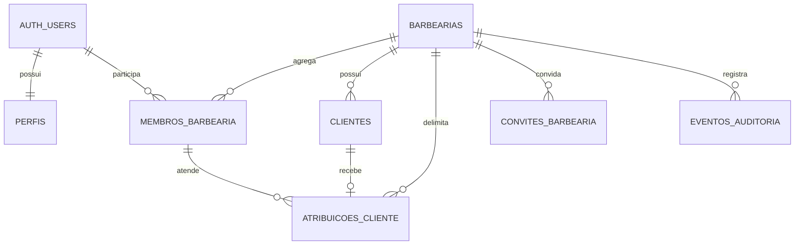

# Banco de dados

Última atualização: **21/08/2026**.

## Estado executivo

O repositório possui uma fundação Supabase em cinco migrations. As três primeiras formam a baseline do passo 2: tenant, identidade mínima, papéis por barbearia, clientes, atribuição de carteira, grants/RLS e três buckets privados. A quarta exige e-mail confirmado para conta ativa e AAL2 para todo acesso do dono a dados de negócio e Storage. A quinta adiciona convites, auditoria de domínio e nove RPCs de onboarding/lifecycle. Há seed fictício, cinco rollbacks manuais e duas suítes pgTAP com 168 asserções declaradas.

Isso ainda **não significa backend operacional**. O runtime já possui clientes Supabase SSR e telas de Auth. Em 14/08, `db:start` aplicou as cinco migrations e o seed durante um bootstrap transitório e chegou a iniciar os containers; o Storage então respondeu HTTP 502, a stack encerrou e as portas fecharam. As telas de negócio continuam em mocks, `sessionStorage` e `localStorage`, e nenhuma selfie é enviada ao Storage. Os contratos SQL consumidos pela página de equipe, callbacks e script de provisionamento estão versionados, mas não foram validados pelas jornadas reais.

Os oito artefatos originais do passo 2 — três migrations, três rollbacks, seed e teste — tiveram análise sintática histórica. As migrations quarta e quinta também possuem down scripts defensivos inspecionados no código, mas não ensaiados, e uma suíte pgTAP transacional versionada/declarada, ainda não executada. Não há evidência de `db:reset`, `db:lint` aprovado, 168 pgTAPs aprovados, Data API/Storage com JWT, concorrência ou rollback/roll-forward. Em 21/08, Docker Desktop/Supabase estão inativos, o serviço Docker está parado e não há listeners em `54320–54324`; não existe projeto Supabase remoto vinculado. O HTTP 502 é uma falha de saúde/infraestrutura ainda sem causa identificada, não uma evidência de bloqueio RLS. Portanto, a baseline do passo 2 continua **em validação operacional**, e o passo 3 está apenas parcial.

## Fonte de verdade e arquivos

As migrations são a única fonte de verdade do banco:

```text
supabase/
├── config.toml
├── migrations/
│   ├── 20260808010000_tenant_core.sql
│   ├── 20260808011000_tenant_rls.sql
│   ├── 20260808012000_private_storage.sql
│   ├── 20260808013000_auth_assurance.sql
│   └── 20260813010000_onboarding_invites_lifecycle_audit.sql
├── rollback/
│   ├── 20260808010000_tenant_core.down.sql
│   ├── 20260808011000_tenant_rls.down.sql
│   ├── 20260808012000_private_storage.down.sql
│   ├── 20260808013000_auth_assurance.down.sql
│   └── 20260813010000_onboarding_invites_lifecycle_audit.down.sql
├── tests/database/
│   ├── step2_tenant_rls.test.sql
│   └── step3_auth_onboarding_lifecycle.test.sql
├── templates/
│   ├── invite.html
│   └── recovery.html
├── seed.sql
├── schema.sql
└── README.md
```

`supabase/schema.sql` não cria tabelas. Ele existe apenas para impedir que o rascunho legado seja confundido com a baseline atual. A primeira migration também falha deliberadamente se detectar qualquer uma das seis tabelas do rascunho antigo; um ambiente legado precisa ser migrado ou recriado conscientemente.

O guia operacional completo está em [`supabase/README.md`](../supabase/README.md).

## Ordem das migrations

1. `20260808010000_tenant_core.sql`: tipos, tabelas, constraints, índices e timestamps.
2. `20260808011000_tenant_rls.sql`: helpers privados, grants explícitos, gatilhos de autoria e policies.
3. `20260808012000_private_storage.sql`: buckets privados, validação do path e policies do Storage.
4. `20260808013000_auth_assurance.sql`: helpers de e-mail confirmado/AAL2 e substituição dos helpers de negócio para exigir step-up do dono.
5. `20260813010000_onboarding_invites_lifecycle_audit.sql`: convites de funcionário, auditoria append-only, proteções de lifecycle e nove RPCs estreitas de convite, aceite, provisionamento, suspensão, reativação e revogação.

Todas usam transação. Os arquivos `.down.sql` ficam fora da pasta de migrations porque o Supabase CLI não os aplica automaticamente; são procedimentos manuais e defensivos. Os dois novos rollbacks recusam estado incompatível, não usam `CASCADE` e precisam ser ensaiados em clone antes de qualquer aplicação em produção.

## Modelo entregue



### `public.barbearias`

Tenant da plataforma.

| Coluna principal | Regra |
| --- | --- |
| `id` | UUID, chave primária |
| `nome` | 2–120 caracteres |
| `slug` | único, minúsculo, 3–80 caracteres, formato `palavras-com-hifen` |
| `logo_path` | path relativo opcional; URL e `..` são recusados |
| `status` | `ativa`, `suspensa` ou `arquivada`; não é alterável pelo cliente web |
| `criado_por` | UUID histórico opcional do autor, sem FK destrutiva para `auth.users` após a quinta migration |
| timestamps | `created_at` e `updated_at` |

### `public.perfis`

Perfil global mínimo ligado um-para-um a `auth.users`. Não contém papel ou tenant.

| Coluna principal | Regra |
| --- | --- |
| `usuario_id` | PK e FK para `auth.users(id)` |
| `nome` | 2–120 caracteres |
| `avatar_path` | path relativo opcional |
| `ativo` | controlado fora das mutations do cliente web |
| timestamps | `created_at` e `updated_at` |

### `public.membros_barbearia`

Fonte de verdade de papel e estado por tenant. A chave composta é `(barbearia_id, usuario_id)`.

| Coluna principal | Regra |
| --- | --- |
| `barbearia_id` | FK obrigatória para `barbearias` |
| `usuario_id` | FK obrigatória para `auth.users` |
| `papel` | `dono` ou `funcionario` |
| `status` | `convidado`, `ativo`, `suspenso` ou `revogado` |
| `convidado_por` | UUID histórico opcional do autor, sem FK destrutiva para `auth.users` após a quinta migration |
| timestamps | `created_at` e `updated_at` |

Uma conta pode participar de mais de uma barbearia e ter um papel diferente em cada uma. `convites_barbearia` e as RPCs de convite, aceite, suspensão, reativação e revogação agora estão versionadas. Promoção e transferência de dono continuam sem comando próprio, e todo o lifecycle ainda precisa ser executado e testado antes de uso real.

### `public.convites_barbearia`

Convite de funcionário separado da membership. Guarda tenant, nome, e-mail normalizado, papel restrito a `funcionario`, status, autores históricos por UUID sem FK destrutiva, expiração, timestamps de transição, código de erro e versão. Estado `aceito` exige `aceito_em` e `aceito_por`; estado `revogado` exige `revogado_em` e `revogado_por`. Um índice parcial impede dois convites abertos para o mesmo e-mail no mesmo tenant.

### `public.eventos_auditoria`

Log de domínio append-only para provisionamento, convite e lifecycle de funcionário. Registra tenant, ator/alvo históricos por UUID sem FK destrutiva, origem, ação allowlisted, entidade, ID, metadados mínimos e instante. Origem `usuario` exige ator; origem `sistema` pode manter ator nulo. Update, delete e truncate são bloqueados por trigger. O constraint de metadados recusa chaves óbvias de segredo e mídia somente no primeiro nível do JSON; conteúdo aninhado ainda exige hardening. Eventos nativos de login/reset/MFA continuam no provedor Auth, fora desta tabela.

### `public.clientes`

Cliente privado e obrigatoriamente associado a uma barbearia.

| Coluna principal | Regra |
| --- | --- |
| `id` | UUID, chave primária |
| `barbearia_id` | FK obrigatória e parte da chave única composta `(barbearia_id, id)` |
| `nome` | 2–160 caracteres |
| `whatsapp` | forma exibida, 8–32 caracteres; seus dígitos precisam coincidir com a forma normalizada |
| `whatsapp_normalizado` | 8–15 dígitos, primeiro diferente de zero e único dentro do tenant |
| `observacoes` | opcional, até 2.000 caracteres |
| `criado_por` | UUID histórico preenchido pelo usuário autenticado no insert, sem FK destrutiva após a quinta migration |
| timestamps | `created_at` e `updated_at` |

O índice `(barbearia_id, lower(nome))` prepara a busca por nome e o índice `(barbearia_id, whatsapp_normalizado)` prepara a busca por telefone. A tela atual ainda filtra o mock no navegador; a paginação e busca server-side pertencem ao passo 6.

### `public.atribuicoes_cliente`

Registra o responsável atual por um cliente. A chave primária `(barbearia_id, cliente_id)` permite somente um responsável atual nessa baseline.

`atribuido_por` preserva o UUID histórico do autor sem FK destrutiva após a quinta migration. `authenticated` mantém insert/delete autorizado por RLS, mas perdeu o grant de `UPDATE` direto de `usuario_id`; `service_role` perdeu todo `UPDATE` da tabela. A reatribuição precisa de uma RPC estreita transacional que ainda não existe.

As duas FKs são compostas:

- `(barbearia_id, cliente_id)` aponta para um cliente do mesmo tenant;
- `(barbearia_id, usuario_id)` aponta para uma membership do mesmo tenant.

Isso impede estruturalmente que um cliente seja atribuído a um funcionário de outra barbearia, mesmo se uma policy for alterada incorretamente.

## Invariantes multi-tenant

- Toda tabela privada de negócio entregue possui `barbearia_id NOT NULL`.
- Papel vem de `membros_barbearia`, nunca de `user_metadata` ou `app_metadata`.
- Dono e funcionário só são considerados quando a membership está `ativa`.
- Acesso de negócio exige e-mail confirmado em `auth.users`, `perfis.ativo = true` e barbearia `ativa`; tenant suspenso/arquivado não aparece nem pode ser alterado pelo dono.
- Dono ativo precisa de claim `aal = aal2` para ler ou alterar dados de negócio e para acessar os buckets de fontes/cutouts. Claim ausente é tratado como AAL1.
- Funcionário ativo permanece autorizado em AAL1 somente no seu escopo de leitura atribuído.
- O próprio perfil e a própria membership permanecem legíveis para uma identidade Auth permanente em AAL1, permitindo identificar o papel do dono e conduzir o bootstrap de MFA sem liberar a barbearia.
- Usuário anônimo do Supabase Auth é recusado mesmo que a conexão utilize o papel PostgreSQL `authenticated`.
- `anon` não recebe grant sobre as sete tabelas públicas versionadas.
- `service_role` nunca é permitido no navegador e não serve como evidência de RLS porque ignora policies.
- As colunas sensíveis `status`, `papel` e `ativo` não possuem grant de escrita ao cliente autenticado.
- Uma atribuição só aceita responsável cuja membership, perfil e barbearia estejam ativos.
- A troca direta de `atribuicoes_cliente.usuario_id` é bloqueada para `authenticated` e todo `UPDATE` de atribuição é bloqueado para `service_role`; reatribuição segura continua pendente.
- `barbearias.criado_por`, `clientes.criado_por`, `membros_barbearia.convidado_por`, `atribuicoes_cliente.atribuido_por`, atores de convite e ator/alvo de auditoria são proveniência histórica por UUID, não identidade autorizativa nem FK para Auth.
- Uma mutation de membership não pode rebaixar ou remover o último dono ativo de uma barbearia ativa. A quinta migration também recusa desativar/apagar o perfil enquanto ele possuir membership ativa de dono. Recuperação e transferência segura de dono continuam sem fluxo próprio.
- IDs e paths do tenant devem vir de contexto autorizado, não apenas do slug informado na URL.

## Matriz de acesso entregue

| Recurso | Dono ativo + AAL2 | Funcionário ativo + AAL1/AAL2 | Dono AAL1, suspenso, outsider ou anônimo |
| --- | --- | --- | --- |
| Barbearia | Lê a própria; altera nome, slug e logo | Lê a própria | Sem acesso de negócio |
| Perfil | Lê/altera o próprio; lê perfis ativos da equipe | Lê/altera o próprio | Identidade permanente pode ler/alterar o próprio perfil; sem dados da equipe |
| Membership | Lê a equipe do próprio tenant | Lê somente a própria linha | Identidade permanente lê somente a própria linha; sem equipe |
| Cliente | CRUD no próprio tenant | Lê apenas cliente atribuído | Sem acesso |
| Atribuição | Lê, cria e remove no próprio tenant; reatribuição por update direto bloqueada | Lê apenas a própria atribuição | Sem acesso |
| Convites | Lê e opera por RPC no próprio tenant | Sem acesso | Sem acesso |
| Auditoria de domínio | Lê eventos do próprio tenant | Sem acesso | Sem acesso |
| Storage de fontes/cutouts | CRUD no path do próprio tenant | Sem acesso direto | Sem acesso |
| Storage de selfies | Sem policy nesta etapa | Sem policy nesta etapa | Sem acesso |

Não existem policies públicas de landing, catálogo ou agendamento nesta etapa. Essas operações devem ser estreitas, limitadas e criadas junto ao fluxo persistido no passo 5, sem abrir as tabelas internas inteiras.

## Helpers e segurança SQL

Os helpers vivem no schema `private`, usam nomes qualificados e `search_path = ''`. Os helpers que precisam consultar tabelas protegidas são `SECURITY DEFINER` para evitar recursão de policies. A execução é revogada de `PUBLIC`, `anon` e `authenticated` antes de ser concedida explicitamente apenas às funções necessárias para `authenticated` e `service_role`.

Funções de autorização:

- `private.usuario_auth_permanente()`;
- `private.usuario_email_confirmado()`;
- `private.usuario_tem_aal2()`;
- `private.usuario_conta_ativa()`;
- `private.usuario_eh_membro(uuid)`;
- `private.usuario_eh_dono(uuid)`;
- `private.usuario_pode_gerenciar_tenant(uuid)`;
- `private.usuario_pode_ver_perfil(uuid)`;
- `private.usuario_pode_ver_cliente(uuid, uuid)`;
- `private.storage_path_valido(text)`;
- `private.usuario_eh_dono_do_storage_path(text)`.

RPCs públicas estreitas da quinta migration:

- dono AAL2: `criar_convite_funcionario`, `revogar_convite_barbearia`, `suspender_funcionario`, `reativar_funcionario` e `revogar_funcionario`;
- conta autenticada/confirmada correspondente: `aceitar_convite_barbearia`;
- somente servidor privilegiado: `marcar_convite_enviado`, `marcar_convite_falhou` e `provisionar_dono_controlado`.

Esses grants e comportamentos foram revisados em fonte, não comprovados por execução.

Os gatilhos `validar_responsavel_atribuicao` e `proteger_ultimo_dono` reforçam invariantes que uma FK simples não expressa.

Os gatilhos registram `criado_por`, `atribuido_por`, atualizam `updated_at`, travam a identidade da membership e protegem o perfil de dono ativo. Os UUIDs de autoria são históricos e não autorizam acesso. A quinta migration também cria `eventos_auditoria` append-only para transições efetivas cobertas pelas nove RPCs; replays/no-ops idempotentes não duplicam evento. Isso ainda não abrange logs nativos de Auth, ações futuras nem auditoria operacional de toda a aplicação.

`usuario_email_confirmado()` consulta o estado autoritativo em `auth.users`; metadata fornecida pelo cliente não confirma conta. `usuario_tem_aal2()` lê a claim `aal` do JWT e considera claim ausente como `aal1`. A migration 4 substitui os helpers de membro, dono, visibilidade de perfil/cliente e Storage para aplicar essas regras sem alterar as policies existentes.

As RPCs fazem suas mutações locais em transação, mas não tornam atômica a orquestração entre Supabase Auth, e-mail, Server Actions e banco. Hoje, resultados de compensação podem ser ignorados pela aplicação; o provisionamento pode deixar identidade Auth órfã ou membership de dono ativa antes de a conta estar operacional; e o aceite de convite ocorre antes da definição de senha. Esses são riscos P1 de consistência/lifecycle a corrigir e cobrir no E2E, não garantias fornecidas pelo schema.

## Storage privado

Três buckets privados são preparados:

| Bucket | Tipos | Limite | Uso futuro |
| --- | --- | ---: | --- |
| `barbervision-hair-sources` | JPEG, PNG, WebP | 15 MiB | fonte privada enviada pelo dono |
| `barbervision-hair-cutouts` | PNG, WebP | 2 MiB | cutout revisado |
| `barbervision-selfies` | JPEG, PNG, WebP | 15 MiB | selfie temporária, somente após decisão de privacidade |

O path obrigatório é:

```text
<barbearia_uuid>/<namespace_uuid>/<arquivo>
```

O path precisa possuir exatamente dois diretórios, ambos UUIDs válidos, e `..` é recusado. As policies comparam somente o primeiro segmento à membership de dono ativa. O segundo UUID serve como namespace para organização/colisão, mas ainda não é validado contra uma linha de template ou selfie; essa ligação será criada junto às entidades correspondentes. `storage.objects.owner_id` não é tratado como autorização do tenant.

As quatro policies de cliente abrangem somente `barbervision-hair-sources` e `barbervision-hair-cutouts`. `barbervision-selfies` é criado privado, mas permanece sem policy para `authenticated`; nenhum upload de selfie é autorizado antes do passo 4 definir consentimento, finalidade, retenção e exclusão.

Os limites de bucket não substituem validação server-side de magic bytes, pixels/dimensões, conteúdo, EXIF/GPS, direitos, quarentena ou expiração. Signed URLs, publicação coordenada e limpeza de órfãos continuam pendentes nos passos 4 e 7. Selfies permanecem somente no navegador no protótipo atual.

O HTTP 502 observado no Storage durante o bootstrap de 14/08 ocorreu no nível de saúde/serviço e permanece sem causa diagnosticada. Ele não valida upload/download e não deve ser interpretado como negação de policy: a validação de RLS/Storage exige endpoint saudável, JWTs reais e cenários permitidos/negados controlados.

## Seed e testes

`supabase/seed.sql` cria somente identidades e dados fictícios com e-mails `.invalid`: dois tenants, donos diferentes, um funcionário ativo, um membro suspenso, clientes de ambos os tenants e uma atribuição. Essas linhas servem como fixtures SQL/RLS; não constituem contas utilizáveis em `signInWithPassword`.

`supabase/tests/database/step2_tenant_rls.test.sql` possui 59 asserções dentro de `BEGIN ... ROLLBACK`. Ele verifica:

- presença das tabelas, RLS e buckets privados;
- ausência de grants amplos para `anon`;
- ausência de mutation direta de membership;
- helpers `SECURITY DEFINER` sem execução por `PUBLIC`;
- isolamento entre dono A e dono B;
- funcionário somente leitura do cliente atribuído;
- membership suspensa, perfil inativo, tenant suspenso, outsider, Auth anônimo e `user_metadata` forjado;
- escrita permitida ao dono apenas no tenant próprio;
- FKs compostas, responsável ativo e proteção do último dono;
- constraints de slug, coerência e unicidade de telefone;
- paths próprios, cruzados, profundidade inválida e ausência de policy de selfies no Storage.

`supabase/tests/database/step3_auth_onboarding_lifecycle.test.sql` declara outras 109 asserções. Ele cobre estrutura/ACL, owner AAL1/AAL2, e-mail confirmado, convites, expiração, aceite/replay, lifecycle de funcionário e auditoria append-only. `provisionar_dono_controlado` e `marcar_convite_falhou` aparecem somente nas verificações estruturais/ACL; seu comportamento funcional, TOTP, callbacks, JWTs reais, outbox e concorrência não são simulados no pgTAP.

O cenário pgTAP de perfil inativo/cross-tenant foi ajustado no arquivo versionado para não violar a nova proteção do perfil de dono ativo. São duas suítes transacionais versionadas/declaradas, com `plan(59)` + `plan(109)`, ainda não executadas; portanto, nenhuma das 168 asserções constitui evidência de aprovação.

Ainda falta executar a suíte num PostgreSQL/Supabase real e acrescentar testes de integração pela API local e endpoint de Storage com JWTs reais. Testar somente `storage.objects` não prova upload/download do blob.

## Execução local

Pré-requisitos: Node.js 22+, dependências instaladas, Docker Desktop em execução e Git instalado/habilitado para registrar um baseline recuperável antes das mutações de banco. Esse baseline não pode incluir segredos, `.env.local` ou `.next/`.

```powershell
npm.cmd run db:start
npm.cmd run db:reset
npm.cmd run db:lint
npm.cmd run db:test
# Marque e confirme o banco descartável somente depois do reset.
npm.cmd run db:test:concurrency
npm.cmd run db:stop
```

O CLI está fixado em `supabase@2.112.0`. `db:reset` recria o banco local, aplica as migrations e executa o seed. As 168 asserções das duas suítes pgTAP transacionais devem passar antes da corrida concorrente. O marcador exigido pelo runner só deve ser aplicado após o reset, porque a recriação do banco pode removê-lo. Nenhum desses comandos deve ser apontado para produção por engano.

Em 14/08/2026, antes do bootstrap transitório, `npm.cmd run db:lint` e `npm.cmd run db:test` chegaram à tentativa de conexão local, mas terminaram em `ECONNREFUSED 127.0.0.1:54322`. Depois, `db:start` aplicou migrations/seed, chegou a iniciar containers e terminou após o HTTP 502 do Storage. Não registre nenhuma dessas tentativas como `db:reset`, lint aprovado, pgTAP aprovado ou integração Storage validada.

Para um projeto remoto explicitamente criado e vinculado:

```powershell
npm.cmd exec supabase -- link --project-ref SEU_PROJECT_REF
npm.cmd exec supabase -- db push --dry-run
npm.cmd exec supabase -- db push
```

Confirme o project ref, revise o dry-run, faça backup e execute os testes antes de aplicar. Não cole migrations parcialmente no SQL Editor.

## Rollback

Existem cinco rollbacks. A ordem inversa começa por onboarding/lifecycle/auditoria, depois auth assurance, Storage, RLS e core. Os dois novos scripts usam preflight, locks e uma única transação; o rollback 5 recusa convites/auditoria não vazios e proveniência incompatível, enquanto o rollback 4 exige que a migration 5 já tenha sido retirada e restaura funções, policies, ACLs e comentários da baseline.

Os scripts não reconciliam automaticamente `supabase_migrations.schema_migrations`. Antes de qualquer rollback real, exporte os dados, valide o ambiente alvo, documente a janela, defina o tratamento do histórico e ensaie o roll-forward. Em desenvolvimento descartável, prefira `npm run db:reset`.

## Entidades ainda não modeladas

A baseline foi mantida mínima para provar autorização antes de espalhar um modelo incompleto. Ainda não existem no banco:

- outbox/retry de e-mail, reenvio reconciliado, transferência/promoção de dono e eventos nativos de autenticação;
- serviços, disponibilidade, bloqueios, agenda, agendamentos e atendimentos;
- sessões públicas, simulações, templates/revisões e resultados;
- promoções, eventos de funil, avaliações, indicações e fidelidade;
- catálogo comercial, cuidados, produtos, preços, estoque, interesse ou reserva;
- comissões, ledger financeiro, conciliação, fechamento e auditoria;
- assinaturas e administração da plataforma.

Essas entidades serão adicionadas por migrations nos passos 5–9, quando seus ciclos, estados, idempotência, privacidade e permissões estiverem definidos. O campo legado `recomendacoes_ia` foi eliminado junto com o rascunho e não faz parte da baseline.

## Critérios pendentes

### Sequência canônica para concluir os passos 2 e 3

1. Estabilizar a stack local: abrir o Docker Desktop na sessão Windows, validar WSL 2/engine, reproduzir o HTTP 502 e capturar `status`/logs de Storage, gateway e banco antes de prosseguir; não atribuir o erro a RLS sem evidência.
2. Instalar/habilitar o Git e criar um baseline recuperável antes de novas mutações, sem versionar segredos, `.env.local` ou `.next/`.
3. Executar `db:reset`, `db:lint` e `db:test`, comprovando as 168 asserções das duas suítes pgTAP transacionais.
4. Depois do `db:reset`, marcar e confirmar o banco descartável; executar `db:test:concurrency` e guardar a evidência.
5. Escrever um runbook reproduzível de rollback/roll-forward que inclua `supabase_migrations`; ensaiar os rollbacks 4–5 e o roll-forward e, ao final, repetir `db:lint`, as 168 asserções pgTAP e `db:test:concurrency`.
6. Criar um `.env.local` controlado e fixtures/identidades reais no Supabase Auth para dono AAL1/AAL2, funcionário e cenário cross-tenant.
7. Criar harness/scripts de integração e validar Data API e Storage com JWTs reais e cenários adversários.
8. Selecionar/configurar o framework E2E, criar a suíte e então executar Auth, e-mail, convite, MFA e lifecycle.
9. Fechar gaps operacionais: outbox/retry, usuário Auth existente, expiração reconciliada, UX do lifecycle, reatribuição estreita, recuperação de TOTP, transferência de dono e seleção multi-tenant.
10. Implementar privacidade, consentimento, retenção e exclusão antes de persistir selfies ou clientes reais.

Até esses critérios serem atendidos, não conecte dados reais aos mocks nem anuncie os passos 2 ou 3 como concluídos.
