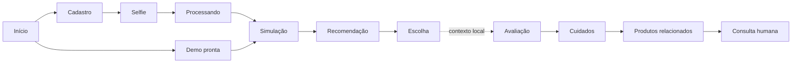

# Fluxos e regras de negócio

Estado reconciliado em **22/08/2026**. Evidência operacional atual: [Estado de validação](ESTADO-VALIDACAO.md).

## Fonte de verdade desta fase

O projeto possui hoje duas camadas diferentes, que não devem ser confundidas:

1. uma demonstração funcional de produto, baseada em `lib/mockData.js`, `sessionStorage` e `localStorage`;
2. uma fundação parcial de Auth/tenant com Supabase, cookies SSR, Proxy e contexto server-side; reset/lint/pgTAP passam, mas RLS por JWT e jornadas continuam sem validação.

Configurar Supabase muda a origem da sessão, mas ainda não migra os dados de negócio. Clientes, simulações, histórico, avaliações, promoções, catálogo, produtos e financeiro continuam fictícios ou locais. Por isso o primeiro fluxo vertical persistido é uma etapa futura, não uma entrega implícita do Auth.

O simulador de cabelo está congelado para esta fase. Seu preparo é local e automático, mas o posicionamento do novo corte é manual: foto à esquerda, controles à direita e confirmação em **Pronto**.

## Modos do painel interno

| Condição | Entrada | Sessão | Dados de negócio | Uso permitido |
| --- | --- | --- | --- | --- |
| Sem Supabase em desenvolvimento | `/barbeiro/login` | Personagem em `sessionStorage` | Mocks/armazenamento local | Demonstração controlada |
| Sem Supabase em produção | Rotas internas | Bloqueadas por padrão | Não carregados | Modo seguro |
| Sem Supabase em produção + flag insegura | `/barbeiro/*` | Personagem em `sessionStorage` | Mocks/armazenamento local | Apresentação isolada, sem dados reais |
| Supabase configurado | Login real | Cookie SSR + claims | Ainda mocks/armazenamento local | Validação técnica do Auth; não operação real |

Regras do Proxy:

- URL e publishable key ausentes: demonstração local; em produção, `/admin` permanece bloqueado e somente `/barbeiro/*` pode ser liberado pelo opt-in explícito;
- Supabase configurado: `/barbeiro/login`, `/barbeiro/esqueci-senha` e `/auth/*` são públicos; as demais rotas de barbeiro exigem claims válidos;
- usuário autenticado que abre `/barbeiro/login` é enviado ao dashboard;
- a flag insegura não ignora Auth configurado;
- `/admin` fica bloqueado quando há Supabase e também em produção, pois o master não possui Auth próprio;
- redirects de contenção usam `307`, sem cache, e removem a query anterior.

## Jornada pública do cliente



### Etapas executáveis

| Etapa | Rota | Comportamento atual | Limite relevante |
| --- | --- | --- | --- |
| Início | `/b/[barbearia]` | Mostra a barbearia e promoções do mock | Qualquer slug recebe o mesmo conteúdo fictício |
| Demo | `/b/[barbearia]/demo` | Cria fluxo com pessoa fictícia e abre a simulação | Não é cliente real |
| Cadastro | `/b/[barbearia]/cadastro` | Guarda nome, WhatsApp e indicação opcional | Sem identidade, consentimento ou deduplicação |
| Selfie | `/b/[barbearia]/selfie` | Valida/reduz/reencoda JPEG, PNG ou WebP localmente | Data URL fica no `sessionStorage` |
| Processando | `/b/[barbearia]/processando` | Exibe mensagens por cerca de 3,4 s | É apenas uma transição visual |
| Simulação | `/b/[barbearia]/simulacao` | Remove visualmente o cabelo, aplica cutout e recebe placement manual | Sem persistência server-side |
| Recomendação | `/b/[barbearia]/recomendacao` | Exibe top 3 fixo | Não é recomendação calculada |
| Escolha | `/b/[barbearia]/escolha` | Mostra horário fictício, copia contexto mínimo e limpa o fluxo | Não agenda, não envia e não cria protocolo |
| Avaliação | `/b/[barbearia]/avaliacao` | Guarda nota local e mostra cuidados/produtos | Não comprova atendimento nem identidade |

### Guardas atuais

A simulação exige fluxo v2 do mesmo slug, nome, WhatsApp e selfie. Para continuar, também exige:

- corte elegível no catálogo;
- recibo de preparo `neutralizacaoCabelo` v3 concluído;
- composição atual pronta;
- placement manual v7 válido para o molde e o corte selecionados;
- `ajusteManual` v2 aplicado e confirmado em **Pronto**.

Objetos antigos de auto-fit v6, placement v4/v5 ou geometria não confirmada são rejeitados. A escolha final exige o mesmo slug, nome, WhatsApp, corte e barba. Essas guardas são UX no navegador, não autorização de segurança.

As demais etapas ainda podem ser abertas diretamente em alguns cenários. A avaliação sem contexto deixa claro que não há atendimento vinculado e só permite visualizar um plano geral.

## Estado local da jornada

Chave de sessão: `barbervision:fluxo`.

```js
{
  versao: 2,
  barbeariaSlug: null,
  etapa: "inicio",
  nome: "",
  whatsapp: "",
  codigoIndicacao: null,
  selfieDataUrl: null,
  corte: null,
  barba: null,
  ajusteCabelo: null,
  neutralizacaoCabelo: null
}
```

`iniciarFluxo()` substitui a jornada anterior; `setFluxo()` faz merge raso; `limparFluxo()` remove a chave. Um objeto sem `versao: 2` é ignorado. Na confirmação final, o fluxo é apagado sem confirmação externa.

Antes da limpeza, somente slug, corte, barba e horário fictício são copiados para `barbervision:pos-venda:v1:<slug>`. Nome, WhatsApp e selfie não entram nesse contexto. Ainda assim, ele é adulterável, não expira por política confiável e não prova que houve atendimento.

### Persistências demonstrativas

| Chave/prefixo | Tecnologia | Conteúdo |
| --- | --- | --- |
| `barbervision:fluxo` | `sessionStorage` | Jornada pública e selfie |
| `barbervision_sessao_barbeiro` | `sessionStorage` | Personagem do login demo |
| `barbervision:hair-catalog:v1` | `localStorage` | Catálogo/recortes locais |
| `barbervision:produtos:v1:<slug>` | `localStorage` | Produtos e WhatsApp comercial |
| `barbervision:pos-venda:v1:<slug>` | `localStorage` | Contexto, avaliação e cuidados |
| `barbervision:financeiro:v1:<slug>:<mês>` | `localStorage` | Fechamento gerencial local |
| `barbervision:financeiro-perfil:v1:<slug>` | `localStorage` | Perfil empresarial declarado |

Nenhuma dessas chaves sincroniza dispositivos ou oferece backup, trilha de auditoria ou controle de acesso confiável.

## Selfie e simulador

### Entrada da foto

Arquivos do cliente passam por validações client-side:

- JPEG, PNG ou WebP;
- até 15 MB;
- mínimo de 320 px por lado;
- máximo original de 25 MP e 10.000 px por lado;
- redução proporcional para no máximo 1.600 px;
- reencode local para JPEG com qualidade 0,88.

Também existe `/demo-cliente.png`, pessoa fictícia frontal. A normalização não envia a selfie a um gerador externo, mas a Data URL ainda fica no navegador sem o consentimento e a retenção exigidos para produção.

### Preparo automático local

Um único comando inicia FaceLandmarker, ImageSegmenter e Canvas da própria aplicação. O preparo:

- detecta face/cabelo para recusar cenários incompatíveis;
- cria uma aproximação visual sem o cabelo original;
- mantém landmarks, máscaras, matte e Canvas derivados apenas em memória;
- tem timeout de carregamento de 45 s;
- permite tentar novamente ou trocar/refazer a selfie.

O recibo persistido é semântico:

```js
{
  versao: 3,
  metodo: "mediapipe-multiclass-local",
  algoritmo: "hair-occlusion-canvas-v3",
  modeloSha256: "...",
  concluida: true,
  resultado: "removido" | "sem-cabelo"
}
```

Essa análise não posiciona o novo corte.

### Placement manual congelado

O cliente seleciona um dos cinco cutouts sintéticos ou um upload local elegível. Cada molde abre com geometria inicial definida pelo catálogo. O painel à direita permite:

- mover em X/Y;
- alterar largura;
- alterar altura;
- corrigir inclinação;
- restaurar a posição inicial;
- confirmar em **Pronto**.

Não há arraste, slider, pincel, clone stamp, espelho, auto-fit ou escolha de fonte no caminho do cliente. Largura e altura são independentes. A foto permanece à esquerda e o painel à direita em 320, 390, 768 px e desktop.

Contrato aprovado:

```js
{
  versao: 7,
  algoritmo: "manual-placement-v1",
  origem: "manual-local",
  automatico: false,
  templateId,
  asset,
  moldeRevisao,
  corte,
  x,
  y,
  largura,
  altura,
  rotacao,
  ajusteManual: {
    versao: 2,
    aplicado: true,
    confirmado: true
  }
}
```

Cada ajuste, reset, troca de corte ou revisão relevante invalida a confirmação. Trocar o corte reutiliza o preparo da selfie e não deve repetir as duas inferências. O cabelo permanece congelado até as etapas prioritárias de segurança, privacidade e persistência avançarem.

### Catálogo do dono

O painel contém cinco amostras sintéticas: Crop texturizado, Quiff moderno, Cachos taper, Slick back e Topo volumoso. O dono também pode preparar localmente PNG/JPEG/WebP de até 1 MB, contornar o cabelo em Canvas, aplicar feather, apagar/restaurar detalhes e gerar PNG/WebP transparente.

O editor de recorte do dono é diferente do placement do cliente. Ele continua local, sem publicação no Storage. Fotos-fonte privadas e referências de terceiros não entram no build ou catálogo; direito de uso, autorização da pessoa e revisão do cutout são aprovações separadas.

## Fluxo de Auth da equipe

### Demonstração sem Supabase

O login oferece três personagens fictícios: João (dono), Marcos e Diego (funcionários). Não solicita e-mail, senha ou código. O objeto salvo não possui token, tenant, assinatura ou expiração.

### Supabase configurado

Fluxo versionado:

1. usuário entra com e-mail e senha em `/barbeiro/login`;
2. confirmação e convites retornam por `/auth/callback` ou `/auth/confirm`;
3. recuperação começa em `/barbeiro/esqueci-senha` e termina em `/barbeiro/redefinir-senha`;
4. conta convidada conclui senha em `/barbeiro/ativar-conta`;
5. contexto server-side valida claims, perfil ativo, membership ativa e barbearia ativa;
6. dono em AAL1 pode entrar no painel ou configurar TOTP em `/barbeiro/mfa`;
7. ausência de membership/barbearia válida leva a `/barbeiro/sem-acesso`;
8. logout local/global está disponível no painel/segurança.

O e-mail é usado para confirmação e recuperação. O segundo fator opcional do dono é TOTP, não um segundo código enviado ao mesmo e-mail.

O bootstrap AAL1 reconhece o papel de dono por seu próprio perfil/membership antes do MFA, sem carregar a barbearia; harness JWT e Playwright comprovaram o fluxo com Supabase real local.

### Convites e provisionamento

A tela `/barbeiro/equipe`, as Server Actions e o script `auth:provision-owner` agora possuem contratos na migration `20260813010000_onboarding_invites_lifecycle_audit.sql`:

- `convites_barbearia` com estados, expiração e unicidade parcial por tenant/e-mail;
- `eventos_auditoria` append-only;
- RPCs de criar/revogar/aceitar convite, marcar envio/falha, provisionar o primeiro dono e suspender/reativar/revogar funcionário;
- autorização do dono ativo, operações service-only e locks de tenant; step-up específico continua pendente para operações futuras de alto risco.

Os UUIDs de procedência são registros históricos, sem FK destrutiva para `auth.users`: `barbearias.criado_por`, `clientes.criado_por`, `membros_barbearia.convidado_por`, `atribuicoes_cliente.atribuido_por`, os atores de criação/aceite/revogação do convite e o ator/alvo da auditoria. Convite aceito ou revogado exige timestamp e ator correspondentes. Em auditoria, origem `usuario` exige ator; origem `sistema` pode manter ator nulo. Uma transição efetiva gera evento, mas repetir um comando quando o estado final já foi alcançado é no-op e não duplica auditoria.

O filtro SQL de nomes de segredo examina somente chaves no nível superior de `eventos_auditoria.metadados`; objetos aninhados ainda precisam de sanitização/allowlist no comando. O `UPDATE` direto de `atribuicoes_cliente.usuario_id` foi revogado de `authenticated`, e `service_role` perdeu `UPDATE` na tabela. Falta uma RPC estreita, autorizada, idempotente e auditada para reatribuição.

Em 23/08, core Supabase, lint SQL e pgTAP 192/192 passaram. Rollback 5–4, concorrência, JWT/Data API, Storage e E2E anterior permanecem evidências históricas; faltam o ensaio 8–4 e o E2E atualizado da outbox.

As compensações da Equipe conferem o estado por releitura autoritativa. O provisionamento inicial possui preflight, reutilização de Auth existente e retomada segura por UUID. Convites de funcionário usam outbox atômica, worker com lease/retry e reconciliação de vencidos; produção ainda precisa configurar seu agendador protegido. Transferência de dono e seletor multi-tenant permanecem lacunas.

## Papéis e telas

O contrato de produto é sempre limitado à própria barbearia.

| Área | Dono | Funcionário | Implementação atual |
| --- | :---: | :---: | --- |
| Dashboard | Sim | Sim | Mock; filtro local |
| Clientes | Sim | Sim, apenas atribuídos | Mock; filtro local |
| Simulações | Sim | Sim, apenas atribuídos | Cards derivados de clientes |
| Histórico | Sim | Sim, apenas atribuídos | Último estado, não eventos |
| Avaliações | Sim | Sim, apenas atribuídas | Mock |
| Segurança | Sim | Sim | Sessão Supabase quando configurada |
| Catálogo | Sim | Não | Layout server-side de dono + dados locais |
| Equipe | Sim | Não | Layout de dono; SQL de convite versionado, não validado |
| Funil | Sim | Não | Layout de dono + mock |
| Promoções | Sim | Não | Layout de dono + estado local da tela |
| Produtos | Sim | Não | Layout de dono + `localStorage` |
| Fidelidade | Sim | Não | Layout de dono + mock |
| Comissões | Sim | Não | Layout de dono + cálculo mock |
| Financeiro | Sim | Não | Layout de dono + `localStorage` |

No modo Supabase, layouts server-side impõem papel para oito áreas exclusivas do dono. Isso é uma melhoria sobre a antiga guarda client-side. Ainda assim, as páginas entregam mocks e não provam o RLS até o banco ser executado e testado. O identificador UUID da sessão real também não torna automaticamente coerentes os filtros `b1`/`b2`/`b3` do mock.

No contrato SQL de clientes, o dono pode criar/remover atribuições e o funcionário somente enxerga sua carteira. Trocar o profissional não pode ser feito por `UPDATE` direto; até existir a RPC estreita de reatribuição, esse lifecycle permanece incompleto na aplicação.

### Clientes e pesquisa

A tela Clientes primeiro restringe o array à carteira local do funcionário e depois aplica uma busca em tempo real:

- nome sem diferenciar maiúsculas/minúsculas ou acentos;
- telefone ignorando formatação e o prefixo opcional `55`;
- botão para limpar e estado vazio específico.

A busca não consulta banco, não pagina e não deve receber todos os clientes de um tenant real no navegador. Em produção, pesquisa e autorização precisam ocorrer juntas no backend/RLS.

### Produtos e pós-venda

O plano de cuidados é determinístico e cosmético. Ele deriva do nome/categoria do corte, não da selfie, couro cabeludo ou condição médica. Após a avaliação local, até três produtos ativos relacionados podem aparecer.

O CTA abre uma mensagem de consulta no WhatsApp ou copia o texto. Isso não cria pedido, reserva, pagamento ou baixa de estoque. O MVP de produto aprovado é venda assistida com confirmação humana e retirada/pagamento presencial.

### Financeiro

O fechamento local separa serviço/produto, bruto, desconto, estorno, taxa, recebido e conciliação. O dono pode fechar, reabrir com justificativa e exportar CSV gerencial.

Porte, natureza jurídica e regime tributário são campos distintos. O sistema não calcula imposto, não gera guia, não transmite DAS/PGDAS-D e não substitui contador. Tudo ainda está em `localStorage`.

## Regras do primeiro fluxo persistido

O passo 5 ainda não começou. Para transformar a jornada pública em operação real, o primeiro recorte deve persistir apenas o necessário:

1. resolver slug para uma barbearia ativa;
2. criar/identificar cliente com regras de consentimento e deduplicação;
3. registrar simulação e escolha sem expor a selfie indevidamente;
4. criar agendamento/solicitação idempotente;
5. exibir protocolo somente após confirmação do servidor;
6. permitir ao painel autorizado consultar o novo registro;
7. emitir token único, expirável e de uso controlado para avaliação;
8. registrar avaliação/cuidados sob o tenant correto;
9. aplicar RLS e testes negativos entre tenants/papéis.

Até isso existir, nenhum texto deve afirmar que houve envio, agendamento, reserva ou venda.

## Sequência canônica de validação

1. Executar o runner concorrente no banco descartável e guardar evidência.
5. Usar o runbook existente para ensaiar rollback/roll-forward 8–4 e repetir `db:lint`, as 192 asserções pgTAP e `db:test:concurrency`.
6. Criar um `.env.local` controlado e fixtures/identidades Auth reais para dono em AAL1 e AAL2, funcionário e cenário cross-tenant.
7. Criar harness/scripts e validar Data API e Storage com JWTs reais e cenários adversários.
8. Ampliar o Playwright aprovado para lifecycle completo, refresh/expiração e cenários adversários.
9. Fechar gaps operacionais: provisionamento retomável com URL validada, decisão explícita sobre a membership do primeiro dono antes da senha, outbox/retry, usuário Auth existente, expiração reconciliada, reatribuição estreita, recuperação de TOTP, transferência de dono e seleção multi-tenant.
10. Implementar privacidade, consentimento, retenção e exclusão antes de persistir selfies ou clientes reais.

## Divergências de linguagem que devem permanecer explícitas

| Texto ou conceito | Realidade atual |
| --- | --- |
| “Enviar para meu barbeiro” | Nenhum envio ocorre |
| Horário confirmado | Horário fictício, sem agenda persistida |
| Indicação automática | Código é apenas armazenado/exibido |
| Simulações do painel | Cards derivados de clientes do mock |
| Histórico | Último estado por cliente, não eventos |
| Barbeiro do mês | Ranking acumulado, sem competência real |
| Estoque/quantidade | Número local, não estoque transacional |
| Avaliação enviada | Gravação local, sem atendimento verificável |
| Fechamento | Relatório gerencial local, não obrigação fiscal |
| Login demo | Seleção de personagem, não autenticação |

## Referências

- [Operação, segurança e qualidade](OPERACAO.md)
- [Decisões de produto](DECISOES-DE-PRODUTO.md)
- [Plano de execução](PLANO-DE-EXECUCAO.md)
- [Simulador de cabelo](SIMULADOR-DE-CABELO.md)
- [Fechamento financeiro](FECHAMENTO-FINANCEIRO.md)
- [Produtos e pós-venda](PRODUTOS-E-POS-VENDA.md)
